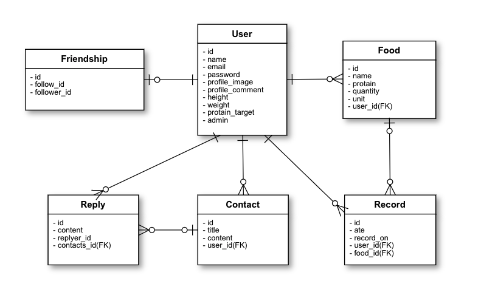
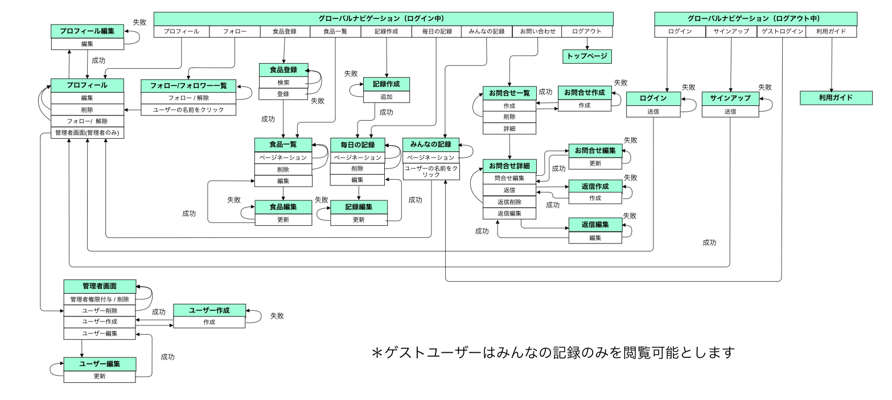

### タイトル
---
#### 「 プロマネ 」

<br>

### 制作背景
---
前職が力仕事で、筋トレをして体重を増やす必要がありました。
食事のタンパク質量を管理することによって体重を増やすことができましたが、卵1個には4g、豆腐1丁には6g、というように食材毎のタンパク質量を計算するのは大変でした。
手軽にタンパク質を管理できるツールがあれば良いのに、と思った為このアプリケーションを作成しました。

### 概要
---
体重を増やしたい、筋肉を増やしたい人向けのタンパク質摂取量の可視化アプリ。
プロマネを使うことで食品とタンパク質含有量を記録し、タンパク質摂取量を簡単に管理できるようになります。

### 開発言語
---

* Ruby 2.6.5
* Rails 5.2.5
* PostgreSQL 13.2

### 機能一覧
* ユーザー管理機能
* フォロー機能
* ログイン機能
* ゲストログイン機能
* 管理者権限機能
* 食品登録機能
* 食品検索機能
* 食品記録機能
* お問合せ機能
* カレンダー機能
* BMI計算機能
* Heroku
* ご利用ガイド

### 使用gem一覧
---
* devise
* devise-i18n
* rails_admin
* cancancan
* kaminari
* mini_magick
* ransack
* simple_calendar
* chartkick

### 実行手順
---

```
$ git clone https://github.com/sannaga3/pro_mana.git
$ cd pro_mana
$ bundle install
$ rails db:create && rails db:migrate
$ rails s
```
### カタログ設計
---
https://docs.google.com/spreadsheets/d/1b-93eLD9PEazR-0uknWynZlzxDp9Q4nkhaAt-NXBC9M/edit?usp=sharing

### テーブル定義所
---
https://docs.google.com/spreadsheets/d/1b-93eLD9PEazR-0uknWynZlzxDp9Q4nkhaAt-NXBC9M/edit#gid=1639636113

### ワイヤーフレーム
---
https://docs.google.com/spreadsheets/d/1b-93eLD9PEazR-0uknWynZlzxDp9Q4nkhaAt-NXBC9M/edit#gid=208904404

### ER図
---


### 画面遷移図
---

